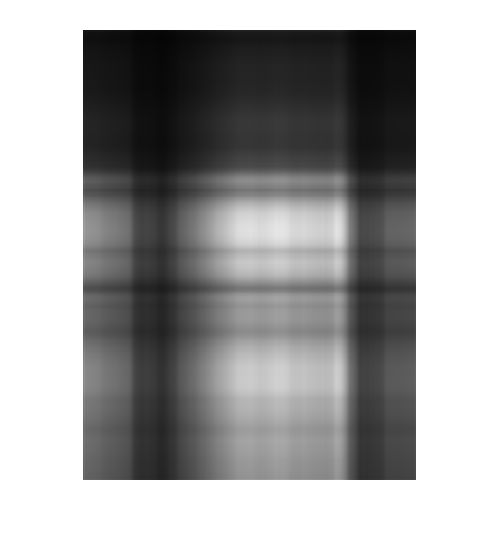

---
tag:summary/basic_theory
---
## SVD分解
### 基本原理
$$
\mathbf{M} = \mathbf{U} \boldsymbol{\Sigma} \mathbf{V}^T
$$

这里
* $\mathbf{U}$ 是一个$m \times m$ 的正交阵.
* $\boldsymbol{\Sigma}$ 是一个$m \times n$ 的对角阵.
* $\mathbf{V}$ 是一个$n \times n$的正交阵.

__SVD分解的几何意义: 奇异值分解应该就是把一个线性变换分解成两个线性变换, 一个线性变换代表旋转, 另一个代表拉伸.__
在原空间找到一组标准正交基V, 同时可以在像空间找到一组标准正交基U, 我们知道, 看一个矩阵的作用效果只要看它在一组基上的作用效果即可, 在内积空间上, 我们更希望看到它在一组标准正交基上的作用效果. 而矩阵A在标准正交基V上的作用效果恰好可以表示为在U的对应方向上只进行纯粹的伸缩:
$\mathbf{M} \mathbf{x} = \mathbf{U} \boldsymbol{\Sigma} \mathbf{V}^T \mathbf{X}$, 这里$\mathbf{V}^T \mathbf{X}$将$\mathbf{X}$投影到$\mathbf{V}^T$的基上, 然后, 再做一个scale, 在以$\mathbf{U}$为基还原向量.

### 奇异值分解实例([来源](https://www.zhihu.com/question/22237507/answer/28007137))
上野树里(Ueno Juri)的一张照片($450 \times 333$), 矩阵上每个元素的数值对应着像素值, 我们记这个像素矩阵为$\mathbf{A}$.

对矩阵$\mathbf{A}$进行奇异值分解:

$$
A=\sigma_{1} u_{1} v_{1}^{\mathrm{T}}+\sigma_{2} u_{2} v_{2}^{\mathrm{T}}+\ldots+\sigma_{r} u_{r} v_{r}^{\mathrm{T}}
$$

令$A_1 = \sigma_{1} u_{1} v_{1}^{\mathrm{T}}$, 这只保留等式右边第一项, 然后作图:

结果就是完全看不清是啥……我们试着多增加几项进来:

$$
A_5 = \sigma_{1} u_{1} v_{1}^{\mathrm{T}} + \sigma_{2} u_{2} v_{2}^{\mathrm{T}} + \sigma_{3} u_{3} v_{3}^{\mathrm{T}} + \sigma_{4} u_{4} v_{4}^{\mathrm{T}} + \sigma_{5} u_{5} v_{5}^{\mathrm{T}}
$$

隐约可以辨别这是短发伽椰子的脸……但还是很模糊, 毕竟我们只取了5个奇异值而已。下面我们取20个奇异值试试, 也就是等式右边取前20项构成$A_{20}$:

取50个, $A_{50}$

__奇异值往往对应着矩阵中隐含的重要信息,且重要性和奇异值大小正相关. 每个矩阵A都可以表示为一系列秩为1的"小矩阵"之和,而奇异值则衡量了这些"小矩阵"对于A的权重. 矩阵$\mathbf{A} = \mathbf{U}_{d \times d} \Sigma_{d \times d} \mathbf{V}_{d \times d}^T \approx \mathbf{U}_{d \times r} \Sigma_{r \times r} \mathbf{V}_{r \times d}^T$.__

## Eigen分解(特征分解)
Eigen分解与SVD分解一样, 对于可对角化的矩阵, 该线性变换的作用就是将某些(特征向量), 在该方向上做伸缩. 特征向量不一定相互垂直, 实对称矩阵的特征向量相互垂直.

Eigen分解与SVD分解相互关系
对$\mathbf{M}^T \mathbf{M}$求特征值, $(\mathbf{M}^T \mathbf{M}) \mathbf{V} = \lambda \mathbf{V}$, 则其特征值特征向量与$\mathbf{M}$的SVD分解结果之间的关系为
$$
\mathbf{M}^T \mathbf{M} = \mathbf{V} \Sigma^T \mathbf{U}^T \mathbf{U} \Sigma \mathbf{V}^T = \mathbf{V} \Sigma^T \Sigma \mathbf{V}^T
$$

## Reference
[奇异值的物理意义的理解](https://www.zhihu.com/question/22237507/answer/28007137)
[特征值分解、奇异值分解、PCA概念整理](https://blog.csdn.net/jinshengtao/article/details/18448355)