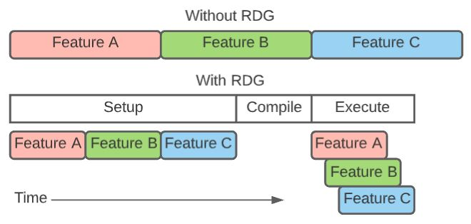

---
tags:
- cg/engine_framework
---
# UE Render

## UE Render Basic

### VertexFactory

1. `FVertexFactory`封装了可以链接到顶点着色器的顶点数据资源.
  关注的三点: data layout、data binding、data updating

2. 使用组件的方式: 一个vertex attribute可以看做是一个component, 一个Vertex类可以由多个component组合进行描述.

3. 针对不同的类型的绘制需求(如网格绘制、粒子绘制、骨骼蒙皮绘制), 对其共性进行提取, 从而派生除了多种不同的子类(以供复用).


设计图:


`FLocalVertexFactory`代码简析:

```c++
/**
 * static mesh 常用的数据
 **/
struct FStaticMeshDataType
{
  /** The stream to read the vertex position from. */
  FVertexStreamComponent PositionComponent;

  /** The streams to read the tangent basis from. */
  FVertexStreamComponent TangentBasisComponents[2];

  /** The streams to read the texture coordinates from. */
  TArray<FVertexStreamComponent, TFixedAllocator<MAX_STATIC_TEXCOORDS / 2> > TextureCoordinates;

  /** The stream to read the shadow map texture coordinates from. */
  FVertexStreamComponent LightMapCoordinateComponent;

  /** The stream to read the vertex color from. */
  FVertexStreamComponent ColorComponent;

  FRHIShaderResourceView* PositionComponentSRV = nullptr;

  FRHIShaderResourceView* TangentsSRV = nullptr;

  /** A SRV to manually bind and load TextureCoordinates in the Vertexshader. */
  FRHIShaderResourceView* TextureCoordinatesSRV = nullptr;

  /** A SRV to manually bind and load Colors in the Vertexshader. */
  FRHIShaderResourceView* ColorComponentsSRV = nullptr;

  int LightMapCoordinateIndex = -1;
  int NumTexCoords = -1;
  uint32 ColorIndexMask = ~0u;
  uint32 LODLightmapDataIndex = 0;
};

/**
 * A typed data source for a vertex factory which streams data from a vertex buffer.
 *
 * FDataType实例最重要的成员就是Stream Components. 可能你已经注意到每个Stream Components都存储着独立的数据, 
 * 也就是一个顶点缓冲 Vertex Buffer 对应一种属性(位置, 纹理坐标等等). 
 * UE没有将所有的属性都存储在一个顶点缓冲(Vertex Buffer)中而是每个属性存储在独立的顶点缓冲(Vertex Buffer). 
 * 这样的选择有很多好处, 具体可以参看这篇文章here: 
 * https://anteru.net/blog/2016/storing-vertex-data-to-interleave-or-not-to-interleave. 
 */
struct FVertexStreamComponent
{
  /** The vertex buffer to stream data from.  If null, no data can be read from this stream. */
  const FVertexBuffer* VertexBuffer = nullptr;

  /** The offset to the start of the vertex buffer fetch. */
  uint32 StreamOffset = 0;

  /** The offset of the data, relative to the beginning of each element in the vertex buffer. */
  uint8 Offset = 0;

  /** The stride of the data. */
  uint8 Stride = 0;

  /** The type of the data read from this stream. */
  TEnumAsByte<EVertexElementType> Type = VET_None;

  EVertexStreamUsage VertexStreamUsage = EVertexStreamUsage::Default;
  ...
};

/**
 * 定义了一个vertex attribute 
 */
struct FVertexElement
{
  uint8 StreamIndex;
  uint8 Offset;
  TEnumAsByte<EVertexElementType> Type; //!< 类似DirectX的DXGI_FORMAT 和 Vulkan的VKFormat
  uint8 AttributeIndex;
  uint16 Stride;
  /**
    * Whether to use instance index or vertex index to consume the element.  
    * eg if bUseInstanceIndex is 0, the element will be repeated for every instance.
    */
  uint16 bUseInstanceIndex;
  ...
};


//
// shader binding
//
typedef TArray<struct FVertexElement,TFixedAllocator<MaxVertexElementCount> > 
  FVertexDeclarationElementList;

/**
 * Vertex Declaration就是对输入布局(Input Layout)封装的RHI Resource.
 */
class FRHIVertexDeclaration : public FRHIResource
{
public:
	FRHIVertexDeclaration() : FRHIResource(RRT_VertexDeclaration) {}
	virtual bool GetInitializer(FVertexDeclarationElementList& Init) { return false; }
};


 /*
  * !!这里还没有与shader code对应结合起来.--
  */
class FVulkanVertexDeclaration : public FRHIVertexDeclaration
{
public:
  FVertexDeclarationElementList Elements;

  FVulkanVertexDeclaration(const FVertexDeclarationElementList& InElements) : Elements(InElements) {}

  virtual bool GetInitializer(FVertexDeclarationElementList& Out) final override
  {
    Out = Elements;
    return true;
  }

  static void EmptyCache();
};

////////////////////////////////////////////////////////////////////////////////////////////////

/**
 * A vertex factory which simply transforms explicit vertex attributes from local to world space.
 */
class ENGINE_API FLocalVertexFactory : public FVertexFactory
{
  DECLARE_VERTEX_FACTORY_TYPE(FLocalVertexFactory);
public:
  struct FDataType : public FStaticMeshDataType
  {
    FVertexStreamComponent PreSkinPositionComponent;
    FRHIShaderResourceView* PreSkinPositionComponentSRV = nullptr;
  #if WITH_EDITORONLY_DATA
    const class UStaticMesh* StaticMesh = nullptr;
    bool bIsCoarseProxy = false;
  #endif

  /**
    * An implementation of the interface used by TSynchronizedResource to 
    * update the resource with new data from the game thread.
    */
  void SetData(const FDataType& InData)
  {
    Data = InData;
    ...
    InitRHI();
  }

  void InitRHI()
  {
    ...
    // 将用到的components加入
    FVertexDeclarationElementList Elements;
    if (Data.PositionComponent.VertexBuffer != nullptr)
    {
      Elements.Add(AccessStreamComponent(Data.PositionComponent,0));
    }
    ...

    // rhi declaration
    InitDeclaration(Elements);
  }
  ...
protected:  
  FDataType Data;
};
```

在UE中采用模板化方法来构建vertex factory的shader代码. 通过vertex factory生成了vertex shader中用来获取数据的函数. 保存在`.ush`文件中, 以供vertex shader代码使用. 通过这样的方式自动构建联系.

```c++
// example of  Engine/Shaders/Private/GpuSkinVertexFactory.ush
...
// 定义了输入
struct FVertexFactoryInput
{
	float4	Position		: ATTRIBUTE0;
	// 0..1
	HALF3_TYPE	TangentX		: ATTRIBUTE1;
	// 0..1
	// TangentZ.w contains sign of tangent basis determinant
	HALF4_TYPE	TangentZ		: ATTRIBUTE2;	

#if GPUSKIN_UNLIMITED_BONE_INFLUENCE
	uint	BlendOffsetCount	: ATTRIBUTE3;
#else
	uint4	BlendIndices	: ATTRIBUTE3;
	uint4	BlendIndicesExtra	: ATTRIBUTE14;
	float4	BlendWeights	: ATTRIBUTE4;	
	float4	BlendWeightsExtra	: ATTRIBUTE15;
#endif // GPUSKIN_UNLIMITED_BONE_INFLUENCE
...
};


/** 
 * Per-vertex inputs from bound vertex buffers.
 * Used by passes with a trimmed down position-only shader.
 */
struct FPositionOnlyVertexFactoryInput
{
	float4	Position	: ATTRIBUTE0;

	// Dynamic instancing related attributes with InstanceIdOffset : ATTRIBUTE1
	VF_GPUSCENE_DECLARE_INPUT_BLOCK(1)

#if (USE_INSTANCING || USE_INSTANCE_CULLING)
	float4 InstanceOrigin : ATTRIBUTE8;  // per-instance random in w 
	half4 InstanceTransform1 : ATTRIBUTE9;  // hitproxy.r + 256 * selected in .w
	half4 InstanceTransform2 : ATTRIBUTE10; // hitproxy.g in .w
	half4 InstanceTransform3 : ATTRIBUTE11; // hitproxy.b in .w
#endif	// USE_INSTANCING

#if USE_INSTANCING
	uint InstanceId : SV_InstanceID;
#endif

#if MANUAL_VERTEX_FETCH
	uint VertexId : SV_VertexID;
#endif
};
...
```

预编译宏(preprocessor directive)用于控制默认的输入布局. 这些预编译宏可以在函数ModifyCompilationEnvironment.

__值得参考的点__:
* 利用顶点工厂构建基于component的vertex attribute描述.
  可以有抽取一些常用的写成单独的类. 提供动态组合的方式.
* 生成获取数据的vertex shader代码, 从而构建与vertex shader的联系.


注: 至于顶点数据源, 在UE中的设计也是十分复杂. 有兴趣可以查看[剖析虚幻渲染体系(03)- 渲染机制](https://www.cnblogs.com/timlly/p/14588598.html#332)

### Shader

Shader封装了gpu shader code, 以及c++ ShaderParameter类型——定义了c++代码与gpu shader code之间的数据对应关系.

* Global Shader
  全局着色器，常用于屏幕方块绘制做后处理的着色器.

* Material Shader
  材质属性的着色器(有着共同的材质参数, 以及参数设置接口), 用来根据光照、材质等绘制Mesh.

Shader Inputs(HLSL):

```c++
float2 ViewportSize;
float4 Hello;
float World;
float3 FooBarArray[16];

Texture2D BlueNoiseTexture;
SamplerState BlueNoiseSampler;

Texture2D SceneColorTexture;
SamplerState SceneColorSampler;

RWTexture2D<float4> SceneColorOutput;
```


目标c++输入参数结构体:

```c++
struct FMyShaderParameters
{
    FVector2D ViewportSize;
    FVector4 Hello;
    float World;
    FVector FooBarArray[16];

    FRHITexture*        BlueNoiseTexture = nullptr;
    FRHISamplerState*   BlueNoiseSampler = nullptr;

    FRHITexture*        SceneColorTexture = nullptr;
    FRHISamplerState*   SceneColorSampler = nullptr;

    FRHIUnorderedAccessView* SceneColorOutput = nullptr;
};
```

使用宏来定义shader参数结构体(在编译期间自动生成目标结构体):

```c++
BEGIN_SHADER_PARAMETER_STRUCT(FMyShaderParameters, /** MODULE_API_TAG */)
    SHADER_PARAMETER(FVector2D, ViewportSize)
    SHADER_PARAMETER(FVector4, Hello)
    SHADER_PARAMETER(float, World)
    SHADER_PARAMETER_ARRAY(FVector, FooBarArray, [16])

    SHADER_PARAMETER_TEXTURE(Texture2D, BlueNoiseTexture)
    SHADER_PARAMETER_SAMPLER(SamplerState, BlueNoiseSampler)

    SHADER_PARAMETER_TEXTURE(Texture2D, SceneColorTexture)
    SHADER_PARAMETER_SAMPLER(SamplerState, SceneColorSampler)

    SHADER_PARAMETER_UAV(RWTexture2D, SceneColorOutput)
END_SHADER_PARAMETER_STRUCT()
```


这样写的目的是在编译阶段反射得到这个结构体的metadata, 从而实现与shader参数与c++结构体参数的自动对应+绑定:

```c++
class FMyShaderCS : public FGlobalShader
{
    DECLARE_GLOBAL_SHADER(FMyShaderCS);

    // Generates a constructor which will register FParameter bindings with this FShader instance.
    SHADER_USE_PARAMETER_STRUCT(FMyShaderCS, FGlobalShader);

    // Assign an FParameters type to the shader--either with an inline definition or using directive.
    using FParameters = FMyShaderParameters;
};
```

设置输入参数&使用:

```c++
TShaderMapRef<FMyShaderCS> ComputeShader(View.ShaderMap);
RHICmdList.SetComputeShader(ComputeShader.GetComputeShader());

FMyShaderCS::FParameters ShaderParameters;

// Assign the parameters.
ShaderParameters.ViewportSize = View.ViewRect.Size();
ShaderParameters.World = 1.0f;
ShaderParameters.FooBarArray[4] = FVector(1.0f, 0.5f, 0.5f);

// Submit the parameters.
SetShaderParameters(RHICmdList, ComputeShader, ComputeShader.GetComputeShader(), Parameters);

RHICmdList.DispatchComputeShader(GroupCount.X, GroupCount.Y, GroupCount.Z);
```

值得参考点:

* 构造c++ shader parameter struct与shader参数(uniform buffer, 这里涉及到data alignment)对应

* VS Shader 的attribute(与VertexFactory)与parameter分离.


## Render Graph Builder

### RDG Features

* 自动添加fences等同步命令, 高效简单的实现异步

  Scheduling of asynchronous compute fences

* 通过跟踪临时资源的生命周期和别名, 更好高效地利用内存

  Allocation of transient resources with optimal lifetimes and memory aliasing

* 细粒度的barrier提高并行度/降低等待时延

  Transitioning of sub-resources using split-barriers to hide latency and improve overlap on the GPU

* 并行录制命令

  Parallel command list recording

* 裁剪无用资源和pass

  Culling of unused resources and passes in the graph

* 验证资源依赖和API使用

  Validation of API usage and resource dependencies

* 依赖关系可视化

  Visualization of the graph structure and memory lifetimes in RDG Insights

### 使用流程

* 创建一个`FRDGBuilder` 实例, 往其中配置resource和pass. 调用`FRDGBuilder::Execute` 编译和运行.

* 通过`FRDGBuilder::CreateTexture`、`FRDGBuilder::CreateBuffer` 创建RDG resources.
  创建的RDG Resources只记录资源描述. 当资源需要时, 将按描述进行分配. RDG将跟踪资源的生命周期, 并在剩余的Pass不再引用它时释放和重用内存.
* 使用`FRDGBuilder::AddPass` 结合当前pass参数和一个excution lambda来创建(添加)一个pass
  * pass parameter struct中包含shader parameter以及RDG resources
    * __RDG 通过这些参数来推导pass之间的依赖关系以及资源的lifetime, 必须包含所有用到的资源!__
    * excution lambda执行是为 `GraphBuilder::AllocParameters` 的参数申请内存并赋值.
  * graph执行的时候, 通过excution lambda将RHI command录制到RHI command list.

样例代码(Compute Pass):

```c++
{
    FRDGBuilder GraphBuilder(RHICmdList);

    FMyShaderCS::FParameters* PassParameters = GraphBuilder.AllocParameters<FMyShaderCS::FParameters>();
    //...
    PassParameters->SceneColorTexture = SceneColor;
    PassParameters->SceneColorSampler = TStaticSamplerState<SF_Point, AM_Clamp, AM_Clamp>::GetRHI();
    PassParameters->SceneColorOutput = GraphBuilder.CreateUAV(NewSceneColor);

    GraphBuilder.AddPass(
        // Friendly name of the pass for profilers using printf semantics.
        RDG_EVENT_NAME("MyShader %d%d", View.ViewRect.Width(), View.ViewRect.Height()),
        // Parameters provided to RDG.
        PassParameters,
        // Issues compute commands.
        ERDGPassFlags::Compute,
        // This is deferred until Execute. May execute in parallel with other passes.
        [PassParameters, ComputeShader, GroupCount] (FRHIComputeCommandList& RHICmdList)
    {
        FComputeShaderUtils::Dispatch(RHICmdList, ComputeShader, PassParameters, GroupCount);
    });

    // Execute the graph.
    GraphBuilder.Execute();
}
```

样例代码(Render Pass):

```c++
// render pass parameters 包括vs参数和ps参数
FFogPassParameters* PassParameters = CreateDefaultFogPassParameters(
  GraphBuilder, View, 
  SceneTextures.UniformBuffer, 
  FogUniformBuffer, 
  LightShaftOcclusionTexture, 
  LightShaftParameters)
  {
    PassParameters->VS.ViewUniformBuffer = GetShaderBinding(View.ViewUniformBuffer);
    PassParameters->PS.ViewUniformBuffer = GetShaderBinding(View.ViewUniformBuffer);
    ...
    return PassParameters;
  }

// render target 设置
PassParameters->RenderTargets[0] = FRenderTargetBinding(
  SceneTextures.Color.Target, 
  ERenderTargetLoadAction::ELoad);

PassParameters->RenderTargets.DepthStencil = FDepthStencilBinding(
  SceneTextures.Depth.Target, 
  ERenderTargetLoadAction::ELoad, ERenderTargetLoadAction::ELoad, 
  FExclusiveDepthStencil::DepthRead_StencilWrite);

// add pass by lambda expression
GraphBuilder.AddPass(RDG_EVENT_NAME("Fog"), PassParameters, ERDGPassFlags::Raster, 
[this, &View, PassParameters, bShouldRenderVolumetricFog](FRHICommandList& RHICmdList)
{
  RenderViewFog(RHICmdList, View, View.ViewRect, PassParameters,
   bShouldRenderVolumetricFog)
   {

     // 设置 gp
      SetGraphicsPipelineState(RHICmdList, GraphicsPSOInit, 0);	
      
      // 设置vs shader参数
      SetShaderParameters(RHICmdList, VertexShader, VertexShader.GetVertexShader(), PassParameters->VS);
      
      // 设置fs shader参数
      SetShaderParameters(RHICmdList, PixelShader, PixelShader.GetPixelShader(), PassParameters->PS);

      // Draw a quad covering the view.
      RHICmdList.SetStreamSource(0, GScreenSpaceVertexBuffer.VertexBufferRHI, 0);
      RHICmdList.DrawIndexedPrimitive(GTwoTrianglesIndexBuffer.IndexBufferRHI, 0, 0, 4, 0, 2, 1);
   }
});
```

数据更新:
```c++
// Upload Data
GraphBuilder.QueueBufferUpload(buffer, data, ERDGInitialDataFlags::NoCopy);
```

### 内部原理

依赖关系构建.

RDG将render pipeline分为3段: 
* setup, 负责准备工作, 资源创建以及Render pipeline的配置信息(包括录制Rhi命令的lambda表达式)在此阶段准备好(不真正执行).
  这里lambda表达式中的代码应当只是简单的录制Rhi命令, 保证在并行执行时不会出错.

* compile, 由RDG在execute之前, 自动完成.
  compile做了什么？ TODO

* execute, 真正执行.



## Future Work

- [ ] 并行/异步渲染

## Reference
[剖析虚幻渲染体系（08）- Shader体系](https://www.cnblogs.com/timlly/p/15092257.html#824-vertex-factory)
[UE5.0 RDG Programming Guide](https://docs.unrealengine.com/5.0/en-US/render-dependency-graph-in-unreal-engine/)
[创建虚幻自定义Mesh组件 | Part 1: 深度解释顶点工厂（Vertex Factory）](https://zhuanlan.zhihu.com/p/361322348)
[UE RDG 源码解析](https://www.cnblogs.com/timlly/p/15217090.html)
[UE4 Shader传递流程分析](https://zhuanlan.zhihu.com/p/32661456)