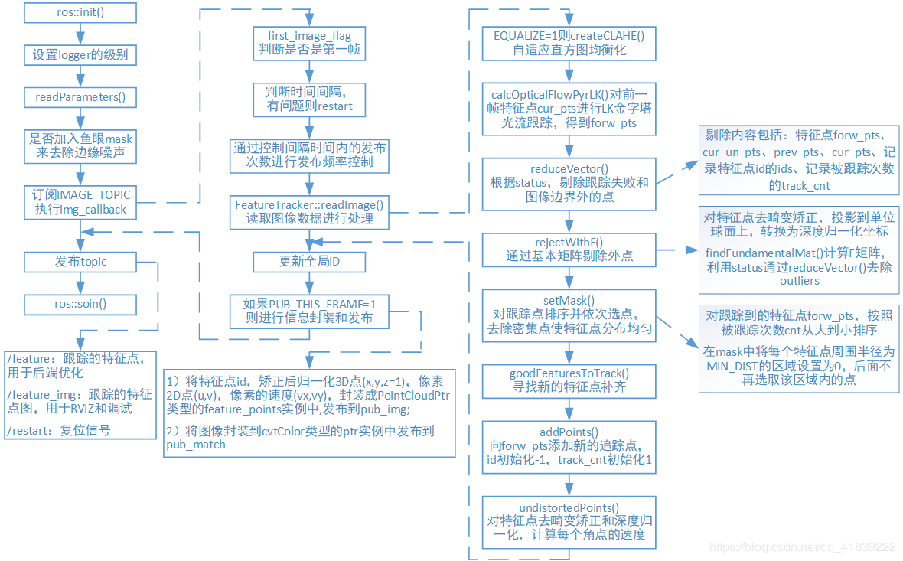

# VINS feature track source code analysis
## Overview


大自流程:
获取图像数据后, 进行LK光流跟踪, 并使用了一系列方法剔除误匹配, 得到较好的帧间匹配点, 然后根据相机内参去畸变, 归一化然后输出.
关键词: LK光流, 剔除外点, 去畸变、归一化.

重要的数据结构
```c++
sensor_msgs::PointCloud
{
    std_msgs/Header header;
    geometry_msgs/Point32[] points;
    sensor_msgs/ChannelFloat32[] channels;
}
```
在points中存储了所有当前图像中追踪到的角点的图像归一化坐标. 在channels中存储了关于该角点的相关信息, 这里共存储了5种信息.
* 角点的id
* 角点像素坐标的横坐标
* 角点像素坐标的纵坐标
* 角点在x方向的速度
* 角点在y方向的速度

## Reference
[VINS源码解读](https://blog.csdn.net/u012871872/article/details/78128087)
[VINS-FeatureTracker代码解读](https://blog.csdn.net/qq_41839222/article/details/85797156)
[VINS中的FeatureTracker](https://zhehangt.github.io/2018/04/18/SLAM/VINS/VINSFeatureTracker/)
