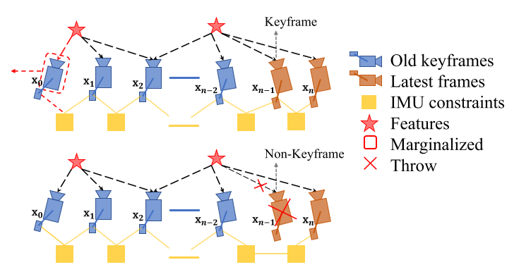

## 初始化
Vision only SFM, five point algorithm做单目相机初始化, 然后使用EPnP算法(此时已经有3D坐标)计算相机的Transfom, 最后使用Bundle Adjustment做最终的优化. 具体流程如下:
>0. 在初始化之前, 调用`bool Estimator::relativePose(Matrix3d &relative_R, Vector3d &relative_T, int &l)`函数来检查第l(l从0开始)帧到滑动窗口最后一帧的平均视差, 若>30, 使用5点法计算相对RT, 开始初始化`bool GlobalSFM::construct(...)`, 否则继续接收下一帧数据.
>1. 通过得到有足够视差的l帧和与当前帧之间的R和T进行三角化得到地图点, 即调用`void GlobalSFM::triangulateTwoFrames(...)`. 
>2. 有了三角化的地图点之后, 对第l帧和当前帧之间所有的图像帧通过 pnp 求解其位姿, 即调用`bool GlobalSFM::solveFrameByPnP(...)`,得到位姿之后, 再次进行三角化得到新的地图点. 
>3. 利用已有的地图点, 对l之前的所有图像帧进行 pnp 求解其位姿, 然后再次进行三角化得到新的地图点. 
>4. 对于其他没有被三角化的角点, 再次进行三角化得到新的地图点. 
>5. 通过一次 full BA 来对地图点和滑动窗口内的关键帧位姿进行优化. 这里的 full BA 只对滑动窗口内的关键帧位姿作优化, 而不优化地图点. VINS在建立重投影误差的时候很有意思, 它并不在图像平面求像素误差, 而是在归一化平面求误差. 
>6. 在视觉初始化的最后, 再次对所有的帧求解一次 pnp. 因为前5步只得到了滑动窗口内所有关键帧的位姿, 但由于并不是第一次视觉初始化就能成功, 此时图像帧数目有可能会超过滑动窗口的大小(根据图像帧的视差判断是否为关键帧, 然后选择滑窗的策略), 此时要对那些不被包括在滑动窗口内的图像帧位姿进行求解. 

### rotation extrinsic calibration
对于窗口中的任意一组数据, 有:

$$
\begin{aligned} \mathbf{q}_{b_{k+1}}^{b_{k}} \otimes \mathbf{q}_{c}^{b} &=\mathbf{q}_{c}^{b} \otimes \mathbf{q}_{c_{k+1}}^{c_{k}} \\ & \Rightarrow\left[\mathcal{Q}_{1}\left(\mathbf{q}_{b_{k+1}}^{b_{k}}\right)-\mathcal{Q}_{2}\left(\mathbf{q}_{c_{k+1}}^{c_{k}}\right)\right] \cdot \mathbf{q}_{c}^{b}=\mathbf{Q}_{k+1}^{k} \cdot \mathbf{q}_{c}^{b}=\mathbf{0} \end{aligned}
$$

这里:

$$
\begin{aligned}
\mathcal{Q}_{1}(\mathbf{q})=\left[\begin{array}{cc}{q_{w} \mathbf{I}_{3}+\left\lfloor\mathbf{q}_{x y z} \times\right\rfloor} & {\mathbf{q}_{x y z}} \\ {-\mathbf{q}_{x y z}} & {q_{w}}\end{array}\right] \\
\mathcal{Q}_{2}(\mathbf{q})=\left[\begin{array}{cc}{q_{w} \mathbf{I}_{3}-\left\lfloor\mathbf{q}_{x y z} \times\right\rfloor} & {\mathbf{q}_{x y z}} \\ {-\mathbf{q}_{x y z}} & {q_{w}}\end{array}\right]
\end{aligned}
$$

为了更好地处理outlier, 根据估计值和预测值之间的角度, 计算每对的权重:

$$
\begin{aligned}
r_{k+1}^{k}=\operatorname{acos}\left(\left(\operatorname{tr}\left(\hat{\mathbf{R}}_{c}^{b^{-1}} \mathbf{R}_{b_{k+1}}^{b_{k}-1} \hat{\mathbf{R}}_{c}^{b} \mathbf{R}_{c_{k+1}}^{c_{k}}\right)-1\right) / 2\right) \\
w_{k+1}^{k}=\left\{\begin{array}{ll}{1,} & {r_{k+1}^{k}<\text { threshold }} \\ {\frac{\text { threshold }}{r_{k+1}^{k}},} & {\text { otherwise. }}\end{array}\right.
\end{aligned}
$$

构建最小二乘求解.

### rotation bias calibration
视觉和IMU的Alignment: 对于旋转而言, 并没有尺度问题, 这里需要计算的是陀螺仪的$b_w$, 因此可以以SFM的值作为真值, 在已知IMU与相机外参的情况下, 优化得到IMU的旋转$\gamma$的真值. 然后根据预测值以及预测值相对于$b_w$的一阶展开计算$b_w$:

$$
\begin{aligned}
\min_{\delta b_w} \sum_{k \in B} \| {\mathrm{q}_{b_{k+1}}^{c_0}}^{-1} \otimes \mathrm{q_{b_k}^{c_0}} \otimes \gamma_{b_{k+1}}^{b_k} \|^2 \\
\gamma_{b_{k+1}}^{b_k} \approx \hat{\gamma}_{b_{k+1}}^{b_k} \otimes \begin{bmatrix} 1 \\ \frac{1}{2} \mathbf{J}_{b_w}^\gamma \delta b_w \end{bmatrix}
\end{aligned}
$$

这里$\gamma_{b_{k+1}}^{b_k}$是IMU从k+1到k的旋转.

外参${\mathbf{x}_{c}^{b}=\left[\mathbf{p}_{c}^{b}, \mathbf{q}_{c}^{b}\right]}$, 是已知的(VINS的实现中, 只给力Rotation的online标定, 没有translation的online标定).

### velocity gravity scale initialization
除了旋转, 还需要计算的量有: 速度, 重力加速度和scale. 将窗口中的这些要求的量结合成一个向量.
$$
\mathcal{X}_I = [\mathrm{v}_{b_0}^{b_0}, \; \mathrm{v}_{b_1}^{b_1}, \cdots, \mathrm{v}_{b_n}^{b_n}, g^{c_0}, s]
$$

通过SfM有每一帧的pose $(\bar{p}_{c_k}^{c_0}, q_c^b)$.  根据已知的外参$(p_c^b, q_c^b)$, 将此pose转换到IMU坐标系上:
$$
\begin{aligned} \mathbf{q}_{b_{k}}^{c_{0}} &=\mathbf{q}_{c_{k}}^{c_{0}} \otimes\left(\mathbf{q}_{c}^{b}\right)^{-1} \\ s \overline{\mathbf{p}}_{b_{k}}^{c_{0}} &=s \overline{\mathbf{p}}_{c_{k}}^{c_{0}}-\mathbf{R}_{b_{k}}^{c_{0}} \mathbf{p}_{c}^{b} \end{aligned}
$$

根据这些已知的信息, 构建约束方程:
$$
\begin{aligned}
\alpha_{b_{k+1}}^{b_k} &= \mathrm{R}_{c_0}^{b_k} (s(\bar{\mathrm{p}}_{b_{k+1}}^{c_0} - \bar{\mathrm{p}}_{b_{k}}^{c_0}) + \frac{1}{2} g^{c_0} \Delta t_k^2 - \mathrm{R}_{b_k}^{c_0} \mathrm{v}_{b_k}^{b_k} \Delta t_k)\\
\beta_{b_{k+1}}^{b_k} &= R_{c_0}^{b_k}(R_{b_{k+1}}^{c_0} \mathrm{v}_{b_{k+1}}^{b_{k+1}}+g^{c_0} \Delta t_k - \mathrm{R}_{b_k}^{c_0} \mathrm{v}_{b_k}^{b_k})
\end{aligned}
$$

从而有
$$
\mathbf{H}_{b_{k+1}}^{b_{k}} \mathcal{X}_{I} = \hat{\mathbf{z}}_{b_{k+1}}^{b_{k}}
$$

这里
$$
\begin{aligned}
\mathbf{H}_{b_{k+1}}^{b_{k}} &= \left[\begin{array}{cccc}{-\mathbf{I} \Delta t_{k}} & {\mathbf{0}} & {\frac{1}{2} \mathbf{R}_{c_{0}}^{b_{k}} \Delta t_{k}^{2}} & {\mathbf{R}_{c_{0}}^{b_{k}}\left(\overline{\mathbf{p}}_{c_{k+1}}^{c_{0}}-\overline{\mathbf{p}}_{c_{k}}^{c_{0}}\right)} \\ {-\mathbf{I}} & {\mathbf{R}_{c_{0}}^{b_{k}} \mathbf{R}_{b_{k+1}}^{c_{0}}} & {\mathbf{R}_{c_{0}}^{b_{k}} \Delta t_{k}} & {\mathbf{0}}\end{array}\right]\\
\hat{\mathbf{z}}_{b_{k+1}}^{b_{k}} &= \left[\begin{array}{c}{\hat{\boldsymbol{\alpha}}_{b_{k+1}}^{b_{k}}-\mathbf{p}_{c}^{b}+\mathbf{R}_{c_{0}}^{b_{k}} \mathbf{R}_{b_{k+1}}^{c_{0}} \mathbf{p}_{c}^{b}} \\ {\hat{\boldsymbol{\beta}}_{b_{k+1}}^{b_{k}}}\end{array}\right]
\end{aligned}
$$

优化目标函数:
$$
\min _{\mathcal{X}_{I}} \sum_{k \in \mathcal{B}}\left\|\hat{\mathbf{z}}_{b_{k+1}}^{b_{k}}-\mathbf{H}_{b_{k+1}}^{b_{k}} \mathcal{X}_{I}\right\|^{2}
$$

重力加速度优化, 通过对重力的大小进行约束, 来优化重力加速度. 这里假设重力加速度的值是已知的, 从而, 重力加速度可以参数化为$g \cdot \hat{\bar{\mathbf{g}}}+w_{1} \mathbf{b}_{1}+w_{2} \mathbf{b}_{2}$, 这里$g$是重力加速度的大小, $\hat{\bar{\mathbf{g}}}$是重力加速度的方向(这个量也是已知的), 而$\mathbf{b}_{1}$和$\mathbf{b}_{2}$是另外两个标架方向(可以通过与$\hat{\bar{\mathbf{g}}}$叉积求取). 自由度变为2, 带入目标优化函数求解.
实现见:
```c++
// file VINS-Mono-master/vins_estimator/src/estimator.cpp
bool Estimator::initialStructure()
```

## 残差的表示和优化
状态向量共包括滑动窗口内的n+1个所有相机的状态(包括位置、朝向、速度、加速度计bias和陀螺仪 bias)、Camera 到 IMU的外参($\mathbf{p}_c^b, \mathbf{q}_c^b$)、m+1个3D点的逆深度($\lambda$):
$$
\begin{array}{l}{\mathcal{X}=\left[\mathrm{x}_{0}, \mathrm{x}_{1}, \cdots \mathrm{x}_{n}, \mathrm{x}_{c}^{b}, \lambda_{0}, \lambda_{1}, \cdots \lambda_{m}\right]} \\ {\mathbf{x}_{k}=\left[\mathbf{p}_{b_{k}}^{w}, \mathbf{v}_{b_{k}}^{w}, \mathbf{q}_{b_{k}}^{w}, \mathbf{b}_{a}, \mathbf{b}_{g}\right], k \in[0, n]} \\ {\mathbf{x}_{c}^{b}=\left[\mathbf{p}_{c}^{b}, \mathbf{q}_{c}^{b}\right]} \text{ \quad is known before}
\end{array}
$$

目标函数, 这里使用了与量纲无关的马氏距离(Mahalanobis norm):
$$
\begin{array}{c}{\min_{\mathcal{X}}\left\{\left\|\mathbf{r}_{p}-\mathbf{H}_{p} \mathcal{X}\right\|^{2}+\sum_{k \in \mathcal{B}}\left\|\mathbf{r}_{\mathcal{B}}\left(\hat{\mathbf{z}}_{b_{k+1}}^{b_{k}}, \mathcal{X}\right)\right\|_{\mathbf{P}_{b_{k+1}}^{b_k}}^{2}+\right.} \\ {\sum_{(l, j) \in \mathcal{C}} \rho\left(\left\|\mathbf{r}_{\mathcal{C}}\left(\hat{\mathbf{z}}_{l}^{c_{j}}, \mathcal{X}\right)\right\|_{\mathbf{P}_{l}^{c_{j}}}^{2}\right)} \} \end{array}
$$

### ②视觉残差

### ③Marginalization
为了减少计算复杂度, 这个基于优化的VIO加入了Marginalization, 只选择关键帧加入到优化中: 当新的一帧是关键帧时, 则最早的那帧被`marginalized out`; 若新的一帧不是关键帧, 则视觉的测量丢弃, 记录IMU预积分(继续推导).


>>> TODO

残差是两帧之间的吗, 即每两帧之间单独计算(以一个clean base)???

### 滑动窗口
滑动窗口策略, 以及keyframe筛选策略.

## 启发
IMU的残差, 其本质是IMU积分得到的camera两帧之间的状态差$\delta z_{imu}$, 与当前状态差$\delta z_{opt}$之前的差, 并以马氏距离来表示误差大小. 该思想可以扩展到其他传感器上.