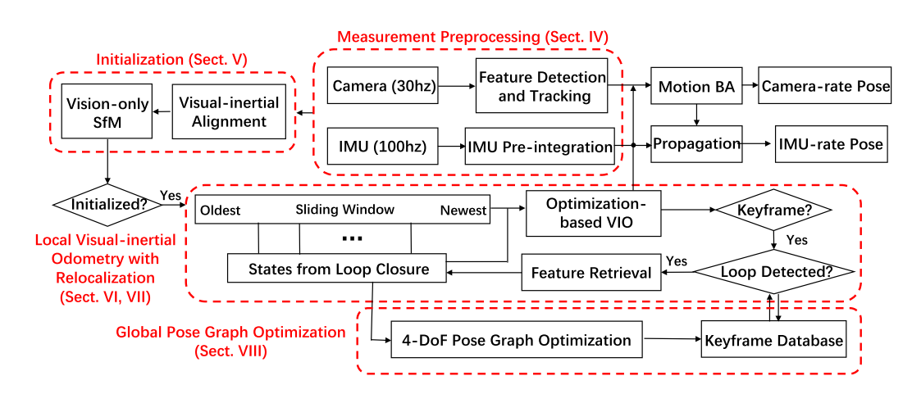
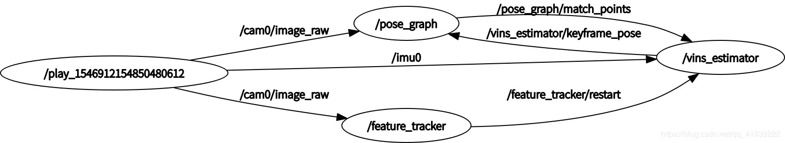
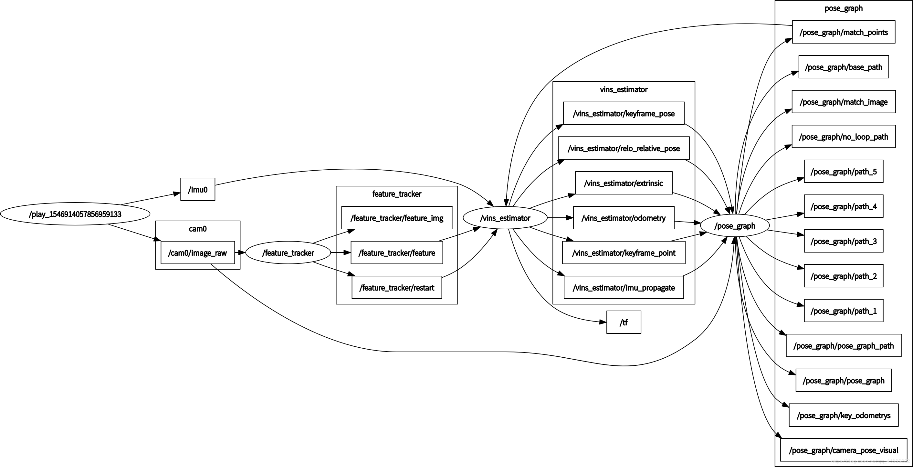

# VINS Source Code Analysis
## 总体框架

节点和topic图:

## 模块&功能
可以分为三个模块:
* feature_tracker
    KLT光流跟踪, 得到匹配点, 并计算归一化的像素坐标
* estimator
    是最主要的模块, 实现了: IMU预积分, 初始化(相机与IMU外参标定, 单目尺度的计算, 重力加速度的估计等), 基于优化的VIO(滑窗内的维护, 残差的构建和优化).
* posegraph
    重定位, 回环检测, 后端优化.

## 源码文件介绍
各文件夹功能:
| code | 功能 |
|------|-----|
| ar_demo | 视觉定位的小应用 |
| benchmark_publisher | 订阅估计的estimated_odometry, 然后与CVS中的 groundtruth对比 |
| calibration_images | 订阅相机的话题, 保存成图片, 用于相机校准, 支持鱼眼相机, 针孔相机 |
| camera_model | calib: 相机参数标定   camera_models: 各种相机模型类   chessboard: 检测棋盘格   gpl   sparse_graph   intrinsic_calib.cc: 相机标定模块main函数 |
| config | 配置参数文件 |
| __feature_tracker__ | 使用光流法追踪特征点 |
| __pose_graph__ | keyframe.cpp 关键帧选取、描述子计算与匹配   pose_graph.cpp 位姿图的建立与图优化  pose_graph_node.cpp ROS 节点函数, 回调函数, 主线程 |
| support_files | support_files: 帮助文档、Bow字典、Brief模板文件 |
| __vins_estimator__ | factor: 实现IMU、camera等残差模型   initial: 系统初始化, 外参标定, SFM   utility: 相机可视化, 四元数等数据转换   estimator.cpp: 紧耦合的VIO状态估计器实现   estimator_node.cpp: ROS 节点函数, 回调函数, 主线程   feature_manager.cpp: 特征点管理, 三角化, 关键帧等   parameters.cpp: 读取参数

主要的工程(CMake):
| CMake files | function |
|------|-----|
| vins_estimator/CMakeLists.txt | 生成 vins_estimator Node |
| feature_tracker/CMakeLists.txt | 生成 feature_tracker Node |
| pose_graph/CMakeLists.txt | 生成 pose_graph Node |
| camera_model/CMakeLists.txt | 生成Calibration可执行程序 和camera_model库 |

参数的意义
| 参数名称 | 类型 | 来源 | 功能 |
| ------- | ---- | ---- | ---- |
| IMAGE_TOPIC | string | yaml config file/image_topic | 订阅图像话题名称
| IMU_TOPIC | string | yaml config file/imu_topic | 订阅IMU话题名称
| MAX_CNT | int | yaml config file/max_cnt | max feature number in feature tracking
| MIN_DIST | int | yaml config file/min_dist | min distance between two features
| ROW | int | yaml config file/image_height | 像素行数-图像高度
| COL | int | yaml config file/image_width | 像素列数-图像宽度
| FREQ | int | yaml config file/freq | frequence (Hz) of publish tracking result. At least 10Hz for good estimation. If set 0, the frequence will be same as raw image
| F_THRESHOLD | double | yaml config file/F_threshold | ransac threshold (pixel)
| SHOW_TRACK | int | yaml config file/show_track | 是否发布 tracking image话题
| EQUALIZE | int | yaml config file/equalize | 当图像太亮/暗, 是否打开均衡补偿
| FISHEYE | int | yaml config file/fisheye | 是否使用鱼眼相机
| FISHEYE_MASK | string | yaml config file/fisheye=1 | fisheye_mask.jpg路径
| CAM_NAMES | std::vector<std::string> | parameter.cpp全局变量 | 像素列数-图像宽度
| WINDOW_SIZE | int | parameter.cpp全局变量 20 | 滑动窗口的大小
| STEREO_TRACK | int | parameter.cpp全局变量 false | 是否使用双目追踪
| FOCAL_LENGTH | int | parameter.cpp全局变量 460 | 焦距
| PUB_THIS_FRAME | int | parameter.cpp全局变量 false | 不发布这帧
| NUM_OF_CAM | int | parameter.h 1 | camera的数量
| modelType | Camera::ModelType | yaml config file/model_type kannala_brandt/mei/scaramuzza/pinhole | camera的模型
| SOLVER_TIME | double | max_solver_time | 确保实时性, 最大求解时间 0.04ms
| NUM_ITERATIONS | int | max_num_iterations | 确保实时性, 最大迭代次数 8, 避免冗余计算
| MIN_PARALLAX | double | keyframe_parallax | 关键帧选择的视差阈值 10 pixel
| VINS_RESULT_PATH | int | output_path/vins_result_no_loop.csv | 不加回环的输出结果
| ESTIMATE_EXTRINSIC | int | estimate_extrinsic | IMU和cam相对外参的方式选择, 0-有准确可信的参数；1-有一组初始值, 后面将基于此再优化, 2-完全不知道相对外参, 启动之初进行在线校准(注意开始的时候要有旋转) 保存在 output_path/extrinsic_parameter.csv中
| RIC[0] | cv_R eigen_R | Eigen::Matrix3d | extrinsicRotation | IMU与camera的旋转
| TIC[0] | cv_T eigen_T | Eigen::Vector3d | extrinsicTranslation | IMU与camera的平移
| INIT_DEPTH | double | vins_estimator/parameters.h | camera的数量
| BIAS_ACC_THRESHOLD | double | vins_estimator/parameters.h 1 | acc偏置的阈值
| BIAS_GYR_THRESHOLD | double | vins_estimator/parameters.h 1 | 陀螺仪偏置的阈值
| TD | int | config/td | IMU与camera的固有时钟差
| ESTIMATE_TD | int | config/estimate_td | 置位online estimate time offset between camera and imu
| ROLLING_SHUTTER | int | rolling_shutter: 0 | 0-全局快门；1-卷帘快门

## Reference
[VINS-Mono视觉SLAM总体设计框架解读](https://blog.csdn.net/csdnhuaong/article/details/87346814)
[VINS-初始化](https://zhehangt.github.io/2018/04/19/SLAM/VINS/VINSInitialiaztion/)
[VINS-Mono代码分析总结](https://www.zybuluo.com/Xiaobuyi/note/866099#31-%E7%9B%B8%E6%9C%BA%E4%B8%8Eimu%E4%B9%8B%E9%97%B4%E7%9A%84%E7%9B%B8%E5%AF%B9%E6%97%8B%E8%BD%AC)
[VINS-camera-imu-calibration](Monocular Visual–Inertial State Estimation With Online Initialization and Camera–IMU Extrinsic Calibration)
[残差优化-源码解读](https://zhuanlan.zhihu.com/p/61733458)
[VINS-重定位源码解读](https://blog.csdn.net/qq_41839222/article/details/87878550)
[VINS-Mono论文学习与代码解读](https://blog.csdn.net/qq_41839222/article/details/85793998)