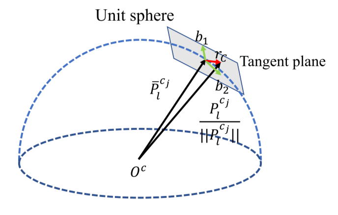

# VINS 视觉残差&先验残差
## 优化变量
优化的是每帧imu在世界坐标系中的位姿, 特征点的逆深度, 相机到IMU的外参以及IMU的bias.
$$
\begin{aligned}
\chi &=[\mathbf{x}_0, \mathbf{x}_1, ..., \mathbf{x}_n, \mathbf{x}_c^b, \lambda_0, \lambda_1, ..., \lambda_m] \\
\mathbf{x}_k &= [\mathbf{p}_{b_k}^w, \mathbf{v}_{b_k}^w, \mathbf{q}_{b_k}^w, \mathbf{b}_a, \mathbf{b}_g], k \in [0, n]\\
\mathbf{x}_c^b &= [\mathbf{p}_c^b, \mathbf{q}_c^b]
\end{aligned}
$$

## 视觉残差公式

在单位球上定义视觉的残差(直观地理解, 比在成像平面上更均匀和通用). 重投影残差表示为:
$$
\mathbf{r}_{\mathcal{C}}\left(\hat{\mathbf{z}}_{l}^{c_{j}}, \mathcal{X}\right)=\left[\begin{array}{ll}{\mathbf{b}_{1}} & {\mathbf{b}_{2}}\end{array}\right]^{T} \cdot\left(\hat{\bar{\mathcal{P}}}_{l}^{c_{j}}-\frac{\mathcal{P}_{l}^{c_{j}}}{\left\|\mathcal{P}_{l}^{c_{j}}\right\|}\right)
$$

这里$\hat{\bar{\mathcal{P}}}_{l}^{c_{j}}$是在第$j$帧中找到的对应feature点, 而$\frac{\mathcal{P}_{l}^{c_{j}}}{\left\|\mathcal{P}_{l}^{c_{j}}\right\|}$是在第$i$帧中找到的对应feature点, 转换到第$j$帧相机坐标系下, 并归一化到到位球面上:

$$
\begin{aligned}
\hat{\bar{\mathcal{P}}}_{l}^{c_{j}} &= \pi_{c}^{-1}\left(\left[\begin{array}{c}{\hat{u}_{l}^{c_{j}}} \\ {\hat{v}_{l}^{c_{j}}}\end{array}\right]\right) \\
\mathcal{P}_{l}^{c_{j}} &= \mathbf{R}_b^c(\mathbf{R}_w^{b_j}(\mathbf{R}_{b_i}^w(\mathbf{R}_c^b \frac{1}{\lambda_l}\pi_c^{-1}(\begin{bmatrix} u_{l}^{c_i} \\ v_l^{c_i} \end{bmatrix}) + \mathbf{p}_c^b)+\mathbf{p}_{b_i}^w-\mathbf{p}_{b_j}^w)-\mathbf{p}_c^b)
\end{aligned}
$$

这里$\pi_{c}^{-1}$是反投影矩阵, $\mathbf{b}_1, \mathbf{b}_2$是切平面上的一组基, $\lambda$是逆深度.

## 先验(边缘化)残差
从优化方程的角度来看: 为了控制优化的规模, 将一些已经优化得差不多的变量(比如老帧的位姿, 老feature点的逆深度)固定(作为已知量). 从而与这些被固定的值有关联的优化变量就需要添加新的约束(先验).

TODO:
1. Schur补Eigen实现的原理
2. 如何将先验约束, 转化为ceres的residual block.