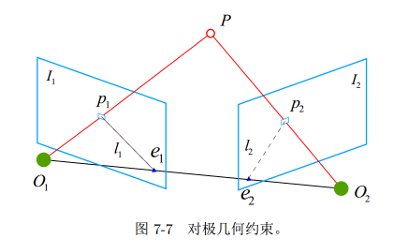
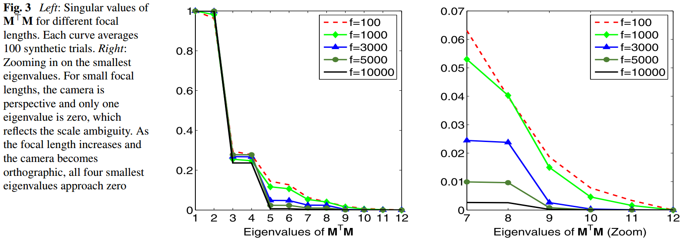

# VO相关知识小记
## 关于坐标系转换
$T_a^b = [R | t]$ 表示将坐标从相机坐标系a转换到相机坐标系b. 则相机从$a \to b$的相对运动可以理解为相机b在相机a坐标系下的位姿$\Leftrightarrow$在b坐标系下, 位于原点的一个朝向前方的向量在相机a中的位姿. 相对运动为$T_b^a = [R^T | -R^T t]$. 

## 极对几何
极对几何约束:

这里, $O_1, O_2, P$三点确定一个平面, 称为 __极平面__. $e_1, e_2$称为 __极点__, $l_1, l_2$称为 __极线__, $O_1O_2$称为 __基线__. 设P在相机1,2下坐标分别为$\mathrm{x}_1, \mathrm{x}_2$, 且 $\mathrm{x}_2 = T_1^2 \mathrm{x}_1 = R \mathrm{x}_1 + t$, 则有:

$$
\begin{aligned}
(R\mathrm{x}_1)^T [t]_{\times} \mathrm{x}_2 &= 0\\
\mathrm{x}_1^T R^T [t]_{\times} \mathrm{x}_2 &= 0\\
\mathrm{x}_1^T E \mathrm{x}_2 = 0, &\quad E = R^T [t]_{\times}
\end{aligned}
$$

也可以表示为:

$$
\begin{aligned}
&E = [t]_{\times} R\\
&\mathrm{x}_2^T [t]_{\times}R \mathrm{x}_1 = 0\\
\end{aligned}
$$

根据相机投影关系$s \mathrm{u} = K \mathrm{x}$, 这里s是一个缩放因子. 又有:

$$
\begin{aligned}
&\mathrm{x} = s K^{-1} \mathrm{u}\\
&\Rightarrow (K^{-1} \mathrm{u}_1)^T E (K^{-1} \mathrm{u}_2) = 0\\ &\Rightarrow \mathrm{u}_1^TK^{-T} E K^{-1} \mathrm{u}_2 = 0\\
&\Rightarrow \mathrm{u}_1^T F \mathrm{u}_2 = 0, \quad F = K^{-T} E K^{-1}
\end{aligned}
$$

由上述公式可知, 当$t=0$时, $F = E = 0$, 此时无法通过极对关系来求取$R$.

本质矩阵E性质:
1. 乘以任意非0常数后依然成立——尺度等价性.
2. E的奇异值形式为$[\delta \; \delta \; 0]$
3. $R^T[t]_{\times}$有6个自由度, 但由于尺度等价性, $E$的自由度为5.

基础矩阵F的自由度为7, 秩为2.

### 8点法求基础矩阵F
只考虑尺度等价性, 使用8对点来计算F:
$$
\begin{bmatrix}u_{1x} & u_{1y} & 1 \end{bmatrix} \begin{bmatrix} e_1 & e_2 & e_3\\ e_4 & e_5 & e_6\\ e_7 & e_8 & e_9 \end{bmatrix} \begin{bmatrix} u_{2x}\\ u_{2y} \\ 1 \end{bmatrix} = 0
$$

将$E$展开有:
$$
\begin{aligned}
&\mathrm{e} = \begin{bmatrix} e_1 & e_2 & e_3 & e_4 & e_5 & e_6 & e_7 & e_8 & e_9 \end{bmatrix}^T\\
&\mathrm{r} = \begin{bmatrix} u_{1x}u_{2x} & u_{1x}u_{2y} & u_{1x} & u_{1y}u_{2x} & u_{1y}u_{2y} & u_{1y} & u_{2x} & u_{2y} & 1 \end{bmatrix}\\
&\mathrm{r} \cdot \mathrm{e} = 0
\end{aligned}
$$

求取最小二乘解, 即$A = \mathrm{r}^T \mathrm{r}$的0空间向量.
最后, 优化Frobenius范数调整$F$, 令$F$的奇异值满足$[\sigma_1 \; \sigma_2 \; 0]$, 对$F$做SVD分解,
令$F = U \mathrm{diag}(\sigma_1 \; \sigma_2 \; 0) V^T$.

### 5点法求本质矩阵E

### 分解本质矩阵E得到R,t
$[t]_{\times}$是一个$3 \times 3$的反对称矩阵, 可表示为 $[t]_{\times} = k U ZU^T$, $U$为正交阵, $Z$可表示为:

$$
Z = \begin{bmatrix} 0 & 1 & 0\\ -1 & 0 & 0\\ 0 & 0 & 0 \end{bmatrix}
$$

因此, 在相差一个尺度因子的情况下, $E = UZU^TR$. 为把矩阵$E$写成SVD分解形式$E = U\Sigma V^T$, 对$Z$进行初等行变换:

$$
[Z | I] = \left[ \begin{array} { c c c | c c c } { 0 } & { 1 } & { 0 } & { 1 } & { 0 } & { 0 } \\ { - 1 } & { 0 } & { 0 } & { 0 } & { 1 } & { 0 } \\ { 0 } & { 0 } & { 0 } & { 0 } & { 0 } & { 1 } \end{array} \right] \Rightarrow \left[ \begin{array} { c c c | c c c } { 1 } & { 0 } & { 0 } & { 0 } & { - 1 } & { 0 } \\ { 0 } & { 1 } & { 0 } & { 1 } & { 0 } & { 0 } \\ { 0 } & { 0 } & { 0 } & { 0 } & { 0 } & { 1 } \end{array} \right] = [\mathrm{diag}(1,1,0) | W]
$$

这里有$W^T = -W$, 从而$E$的SVD分解可写为:

$$
\begin{aligned}
&E = U\mathrm{diag}(1,1,0) W^{-1}U^TR\\
\Rightarrow &V^T = \pm W^{-1}U^TR\\
&V^T = \left\{ \begin{array}{c} W^T U^TR\\ -W^TU^TR=WU^TR \end{array} \right. \\
\Rightarrow &R = \left\{ \begin{array}{c} U W V^T\\ UW^TV^T\end{array} \right.
\end{aligned}
$$

因为$[t]_{\times} t = 0$, $t$属于$[t]_{\times}$的0空间,
$$
\begin{aligned}
[t]_{\times} &= kUZU^T\\
& = k U \mathrm{diag}(1,1,0) W^TU^T\\
& = U \mathrm{diag}(k, k, 0) (UW)^T
\end{aligned}
$$

这里, $[t]_{\times}$的0空间单位向量为$U$的第3列向量.

## Homography单映性矩阵

## H和E的关系

参照极线约束示意图:
$$
\begin{aligned}
l_2 &= e_2 \times p_2 \\
    &= [e_2]_{\times} p_2\\
    &= [e_2]_{\times} H p_1\\
\Rightarrow F &= [e_2]_{\times} H
\end{aligned}
$$

这里, $e_2, p_2$为像素坐标. 应用(orb-slam 关键帧生成新的地图点ORBmatcher::CheckDistEpipolarLine)

## EPNP
EPNP算法利用刚体不变性. 用4个控制点来表示世界坐标系/相机坐标系下的所有点(质心坐标一一对应). 然后根据投影约束, 求取将相机坐标系下的控制点. 最后根据对应的控制点得到Rt.

1. 世界坐标系下质心坐标的构建.
    1.1 去中心化. $x^{w'}_i = x^w_i - \bar{x}^w$, 控制点$c_0 = \bar{x}^w$
    1.2 SVD得到三个主方向$v_0^w, v_1^w, v_2^w$, 得到控制点
        $$
        \begin{aligned}
        c_1^w &= c_0^w + v_0^w\\
        c_2^w &= c_0^w + v_1^w\\
        c_3^w &= c_0^w + v_2^w
        \end{aligned}
        $$
    1.3 计算质心坐标
        $$
        \begin{aligned}
        \alpha_{1i} &= v_0^w \cdot x^{w'}_i\\
        \alpha_{2i} &= v_1^w \cdot x^{w'}_i\\
        \alpha_{3i} &= v_2^w \cdot x^{w'}_i\\
        \alpha_{0i} &= 1 - \alpha_{1i} - \alpha_{2i} - \alpha_{3i}
        \end{aligned}
        $$

2. 根据质心坐标, 以及投影关系, 构建方程.
    投影关系:
    
    $$
    \begin{bmatrix}
    f_x & 0 & c_x\\
    0 & f_y & c_y\\
    0 & 0 & 1
    \end{bmatrix} \cdot \begin{bmatrix} x\\y\\z \end{bmatrix} = \begin{bmatrix} u_x \\ u_y \\ 1 \end{bmatrix}
    $$
    
    有:
    
    $$
    \begin{aligned}
    f_x \cdot x + c_x \cdot z = u_x \cdot z\\
    f_y \cdot y + c_y \cdot z = u_y \cdot z
    \end{aligned}
    \Rightarrow     \begin{aligned}
    f_x \cdot x + (c_x - u_x) \cdot z = 0\\
    f_y \cdot y + (c_y - u_y) \cdot z = 0
    \end{aligned}
    $$

    相机坐标系下的点, 可由控制点的质心坐标表示
    $p_c = \alpha_0 \cdot c_0^c + \alpha_1 \cdot c_1^c + \alpha_2 \cdot c_2^c + \alpha_3 \cdot c_3^c$, 从对于任一点有:
    
    $$
    \begin{aligned}
    &\begin{bmatrix}
    \alpha_0 \cdot f_x & 0 & \alpha_0 \cdot (c_x - u_x) & \alpha_1 \cdot f_x & 0 & \alpha_1 \cdot (c_x - u_x) & \alpha_2 \cdot f_x & 0 & \alpha_2 \cdot (c_x - u_x) & \alpha_3 \cdot f_x & 0 & \alpha_3 \cdot (c_x - u_x)\\
    0 & \alpha_0 \cdot f_y & \alpha_0 \cdot (c_y - u_y) & 0 & \alpha_1 \cdot f_y & \alpha_1 \cdot (c_y - u_y) & 0 & \alpha_2 \cdot f_y & \alpha_2 \cdot (c_y - u_y) & 0 & \alpha_3 \cdot f_y & \alpha_3 \cdot (c_y - u_y)\\
    \end{bmatrix} \\
    &\cdot \begin{bmatrix} x_0 \\ y_0 \\ z_0 \\x_1 \\ y_1 \\ z_1\\x_2 \\ y_2 \\ z_2\\x_3 \\ y_3 \\ z_3 \end{bmatrix} = 0
    \end{aligned}
    $$
    
3. 控制点的坐标近似求解.
    上式可简写为$M\mathbf{x} = 0$, 这个解属于矩阵M的0空间(null space), 这里M是一个$2n \times 12$的矩阵, 可以对$M^TM$进行eigen分解求得.

    $$
    \begin{aligned}
    &\mathbf{x} = \sum_{i=1}^N \beta_i \mathbf{v}_i\\
    &\Rightarrow c_i^c = \sum_{j=1}^N \beta_j \mathbf{v}_j^{[i]}
    \end{aligned}
    $$

    这里, $N=1,2,3,4$. 理论上最少给定6个点, $M^TM$的0空间可以锁定为1维(有一个scale的自由度, 理解为4个控制点一起scale), 当焦距变大趋向于平行投影时, 0空间的自由度可变为4(不管z如何变, 都不会影响投影坐标位置, 理解为每个控制点的z值可以自由变化).
    
    

    不失一般性, 令$N=4$, 目标函数定义为:
    $$
    \mathrm{Error}(\mathbf{\beta}) = \sum_{(i,j) \; s.t. \; i<j} (\parallel c_i^c - c_j^c\parallel^2 - \parallel c_i^w - c_j^w \parallel^2)  
    $$

    简写为:
    $$
    \min \sum_{k=(i,j), i,j\in(1,4), i<j} \parallel D^c_k - D^w_k \parallel
    $$

    这里:
    $$
    \begin{aligned}
    D^w_k &= \parallel c^w_i - c^w_j \parallel^2\\
    D^c_k &= D^c_{ij} = \parallel \beta_1v_{1}^{[i]} +\beta_2 v_{2}^{[i]} + \beta_3 v_{3}^{[i]} + \beta_4 v_4^{[i]} - \beta_1v_{1}^{[j]} -\beta_2 v_{2}^{[j]} - \beta_3 v_{3}^{[j]} - \beta_4 v_4^{[j]}\parallel^2\\
    &= \parallel \beta_1 (v_1^{[i]} - v_1^{[j]}) + \beta_2(v_2^{[i]} -v_2^{[j]}) + \beta_3(v_3^{[i]} -v_3^{[j]}) + \beta_4(v_4^{[i]} -v_4^{[j]})\parallel^2 \\
    &= \parallel \beta_1 dv_{1k} + \beta_2 dv_{2k} + \beta_3 dv_{3k} + \beta_4 dv_{4k}\parallel^2 \\
    &= \beta_{1}^{2} \cdot d v _ { 1 k } ^ { 2 } + 2 \beta _ { 1 } \beta _ { 2 } \cdot d v _ { 1 k } \cdot d v _ { 2 k } + \beta _ { 2 } ^ { 2 } \cdot d v _ { 2 k } ^ { 2 } + 2 \beta _ { 1 } \beta _ { 3 } \cdot d v _ { 1 k } \cdot d v _ { 3 k } + 2 \beta _ { 2 } \beta _ { 3 } \cdot d v _ { 2 k } \cdot d v _ { 3 k }\\
    &+\beta _ { 3 } ^ { 2 } \cdot d v _ { 3 k } ^ { 2 } + 2 \beta _ { 1 } \beta _ { 4 } \cdot d v _ { 1 k } \cdot d v _ { 4 k } + 2 \beta _ { 2 } \beta _ { 4 } \cdot d v _ { 2 k } \cdot d v _ { 4 k } + 2 \beta _ { 3 } \beta _ { 4 } \cdot d v _ { 3 k } \cdot d v _ { 4 k } + \beta _ { 4 } ^ { 2 } \cdot d v _ { 4 k } ^ { 2 }
    \end{aligned}
    $$
    
    求解目标函数, 即求$D_k^c = D_k^w$的最小二乘解, $L_{6 \times 10}\beta_{l10 \times 1} = \rho$ 
    $$
    \begin{aligned}
    L_k&=[dv_1^2,\; 2dv_1dv_2, \; dv_2^2, \; 2dv_1 dv_3, \; 2dv_2dv_3, \; dv_3^2, \; 2dv_1dv_4, \; 2dv_2dv_4, \; 2dv_3dv_4, \; dv_4^2]_k\\
    \beta_l &= [\beta_{11}, \; \beta_{12}, \; \beta_{22}, \; \beta_{13}, \; \beta_{23}, \; \beta_{33}, \; \beta_{14}, \; \beta_{24}, \; \beta_{34}, \; \beta_{44}]^T\\
    \end{aligned}
    $$

    线性化求解:
    近似解1:
    $$
    \begin{aligned}
    &\left\{ \begin{array} { l } { L = [ d v _ { 1 } ^ { 2 } ,\; 2 d v _ { 1 } d v _ { 2 } ,\; 2 d v _ { 1 } d v _ { 3 } ,\; 2 d v _ { 1 } d v _ { 4 } ] } \\ { \beta _ { l } = [ \beta _ { 11 } ,\; \beta _ { 12 } ,\; \beta _ { 13 } ,\; \beta _ { 14 } ] ^ { T } } \end{array} \right.\\
    &\Rightarrow \beta_l = [\sqrt{\beta_{11}}, \; \beta_{12}/\beta_{1}, \; \beta_{13}/\beta_1, \; \beta_{14}/\beta_1]
    \end{aligned}
    $$

    近似解2:
    $$
    \begin{aligned}
    &\left\{ \begin{array} { l } { L = \left[ \begin{array} { l l } { d v _ { 1 } ^ { 2 } , } \; { 2 d v _ { 1 } d v _ { 2 } ,\; 2 d v _ { 2 } d v _ { 2 } } \end{array} \right] } \\ { \beta _ { l } = [ \beta _ { 11 } , \; \beta _ { 12 } , \; \beta _ { 22 } ] ^ { T } } \end{array} \right.\\
    &\Rightarrow \beta_l = [\sqrt{\beta_{11}} \; \sqrt{\beta_{22}} \; 0 \; 0]
    \end{aligned}
    $$

    近似解3:
    $$
    \begin{aligned}
    &\left\{ \begin{array} { l } { L = [ d v _ { 1 } ^ { 2 } , \; 2 d v _ { 1 } d v _ { 2 } , \; d v _ { 2 } ^ { 2 } , \; 2 d v _ { 1 } d v _ { 3 } , \; 2 d v _ { 2 } d v _ { 3 } ] } \\ { \beta _ { l } = [ \beta _ { 11 } , \; \beta _ { 12 } , \; \beta _ { 22 } , \; \beta _ { 13 } , \; \beta _ { 23 } ] ^ { T } } \end{array} \right.\\
    &\Rightarrow \beta_l = [\sqrt{\beta_{11}}, \; \sqrt{\beta_{22}}, \; \beta_{13}/\beta_1, \; 0]
    \end{aligned}
    $$

4. Gaussian-Newton迭代优化近似解.
    $$
    J_{error} = \frac{\partial D^c}{\partial \beta} = \frac{\partial (L \beta_l)}{\partial \beta} = L\frac{\partial \beta_l}{\partial \beta} = L \cdot \begin{bmatrix} 2\beta_1 & 0 & 0 & 0\\
    \beta_2 & \beta_1 & 0 & 0\\
    0 & 2\beta_2 & 0 & 0\\
    \beta_3 & 0 & \beta_1 & 0\\
    0 & \beta_3 & \beta_2 & 0\\
    0 & 0 & 2 \beta_3 & 0\\
    \beta_4 & 0 & 0 & \beta_1\\
    0 & \beta_4 & 0 & \beta_2\\
    0 & 0 & \beta_4 & \beta_3\\
    0 & 0 & 0 & 2\beta_4
    \end{bmatrix} 
    $$

    ORBSLAM_2中使用的是Newton迭代, 即$J\mathrm{x} = -f(\mathrm{x})$. 
    
## Reference
[计算机视觉中的F矩阵, E矩阵与H矩阵](https://vvingerfly.github.io/2017/08-14-CV-Matrix-F-E-H/)
[为什么本质矩阵５自由度, 基础矩阵７自由度, 单应矩阵８自由度](https://www.zhihu.com/question/270431743)