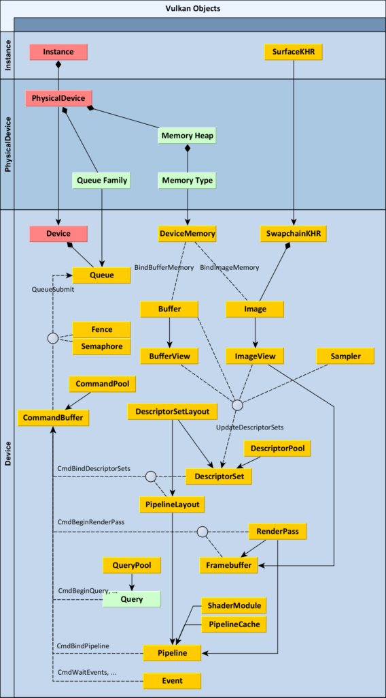
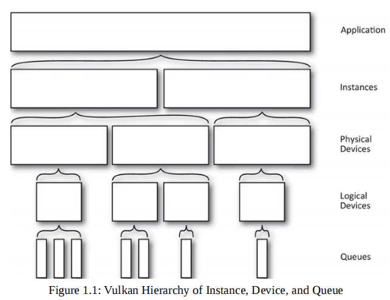

## Vulkan

官网: https://registry.khronos.org/vulkan/

对于初学者而言, 先看[Vulkan Tutorial](https://vulkan-tutorial.com), 对vulkan的基本使用流程有一个基本的了解. 再阅读《Vulkan Programming Guide》 对vulkan的每一个模块做一个更详细的了解.


相关学习资源:
https://www.bilibili.com/video/BV1Vu411R7cb?p=5&vd_source=7a062262419c40cd25995ee92315e93c

https://zhuanlan.zhihu.com/p/536049700

## Vulkan Create Pipeline

refer to: https://web.engr.oregonstate.edu/~mjb/cs557/Handouts/VulkanGLSL.1pp.pdf

![[rc/vulkan_pipeline_create.png]]

### DescriptorSetLayout、PipeLineLayout

refer to: https://vkguide.dev/docs/chapter-4/descriptors/
为了更高效的进行资源的绑定, vulkan要求将资源组织成set进行绑定. 可同时绑定的set有数量的限制, 在有的GPU上可能只允许同时绑定4个set.

![[rc/vk_descriptor.png]]

set-0 用作 engine-global resource, set-1 用作 per pass resource, set-2 用作 material resource, set-3 用作 per-object resource.

参考: [一张图形象理解Vulkan DescriptorSet](https://zhuanlan.zhihu.com/p/450434645)

![[rc/vulkan_descriptor.png]]


### Overview

首先理清vulkan的那些对象的作用以及各自的关联性.  在Vulkan中, 每个object以Vk开头, 把他们当做不可见的handler, 可以在各个函数之间传递, 并需要在不用时释放掉他们.



### 基本流程
1. 创建Vulkan Instance.
    Instance extension包括:
2. 创建 Surface.
    Vulkan无法与window system直接交互, 需要使用WSI(Window System Integration) extension. 这里, 可以直接使用第三方库的封装, 如`glfwCreateWindowSurface`.

3. 选择合适的physical device.
    physical device所需具备的条件: 支持所需要的extension, 支持GRAPHICS_QUEUE+present, 并且至少支持一种surface format+presend mode.
    <small>注: 严谨的来说, 是需要先check physical device是否满足条件, 再pick, 不过[vulkanExamples](https://github.com/SaschaWillems/Vulkan)并没有做check, 当前的device几乎都支持graphics和present, 如果不支持的话, 后续创建logic device也会失败, 并不影响.</small>

4. 创建logical device.
    根据要求设置logical device的特性: enabled features, extension, queue family, layers.

5. 创建Swap chain.
    Vulkan没有默认的frame buffer, 对应的需要显式地创建swap chain(__表示一个待显示的图片队列__):
    * 启用`VK_KHR_swapchain`扩展.
    * 查询/确保 swap chain与当前surface的兼容性(surface format: VK_FORMAT_B8G8R8A8_SRGB... + present mode: VK_PRESENT_MODE_MAILBOX_KHR...).
    * 根据surface format(color, depth), Presentataion mode(将图片转换到屏幕显示的策略), swap extent(resolution)创建swap chain.

6. render pass(render target设置)
    attachment以及其load store设置(在vulkan中depth和color的设置是一起的, 而stencil是独立的)

7. 创建VkDescriptorSetLayout, 用来绑定shader中可以访问的数据, 如uniform buffer, texture.
    descript set是一个可以绑定到pipeline的资源几何, 一个pipeline可以同时绑定多个descript set(vulkan 最少支持4个).

    <small>注: Shader可以通过两种方式来读取/写出数据, ①通过固定的硬件(管线)函数; ②一些可以直接读取或 tt 写出的数据.</small>

    完整的来说, 包含三个步骤:
    * Specify a descriptor layout during pipeline creation
    * Allocate a descriptor set from a descriptor pool
    * Bind the descriptor set during rendering

8. 创建graphics pipeline.
    * vertex + fragment shader
    * viewport state(viewport 和 scissor)
        
        > viewports define the transformation from the image to the framebuffer, scissor rectangles define in which regions pixels will actually be stored
    * 光栅化设置
        geometry $\to$ fragment, depth testing, face culling, scissor test.
        设置包括: depthClampEnable, polygonMode, lineWidth, cullMode, depthBias...
    * multisampling
    * depth and stencil test
    * color blending
    * pipeline layout(设置VkDescriptorSetLayoutBinding)
    
9. 利用swapChainImageView创建frame buffer.

10. 创建command pool, 从而创建command buffer.

11. 创建 texture, vertex, index, uniform buffers.

12. 创建DescriptSetPool而后创建DescriptSet. 参考7.
    
    > Descriptor sets can't be created directly, they must be allocated from a pool like command buffers.
    
13. 创建command buffer, 并加入相关command.
    资源绑定 + draw


#### 数据Align

#### 坐标系的变化
opengl左手坐标系, vulkan 右手坐标系. 影响: face culling, image filp
[The new Vulkan Coordinate System](https://matthewwellings.com/blog/the-new-vulkan-coordinate-system/)
[OpenGL 筆記 - Coordinate System](http://blog.roy4801.tw/2020/07/13/opengl/opengl-note-6/)

Question:
1. render pass如何与swap chain中的imageview联系起来?
2. vertex buffer 和 vertex shader的input是如何联系起来的?
3. command buffer的作用?
4. swap chain中的vkimage大小设置为多少合适?
5. vulkan 对 glsl的版本要求, glsl各版本之间的转换.


### 一些核心概念
<figure class="image">
  
</figure>

* Physical Device (物理设备)
    Physical Device表示系统的硬件.
    >Physical devices are normally parts of the system—a graphics card, accelerator, DSP, or other component.

    ```c++
    // create
    uint32_t gpuCount = 0;
	vkEnumeratePhysicalDevices(instance, &gpuCount, nullptr);
    vkEnumeratePhysicalDevices(instance, &gpuCount, devices.data());
    
    // physical device properties
    // 硬件的属性: 硬件的名称, 制造商, 驱动版本
    vkGetPhysicalDeviceProperties(devices[j], &deviceProperties);
    
    // physical device features
    // 一大堆bool值来表示那些特性被支持, 例如geometry/tessellation shader, textureCompress 
    vkGetPhysicalDeviceFeatures(physicalDevice, &deviceFeatures);
    
    // physical device extension
    /*
     Vulkan extensions are simply additional features that Vulkan implementations may
     provide if they so choose to. They add new functions, structs, and valid 
     enumerators to the API, and they can change some of the behavior of existing 
     functions.
    */
    uint32_t extCount = 0;
    vkEnumerateDeviceExtensionProperties(physicalDevice, nullptr, &extCount, nullptr);
    std::vector<VkExtensionProperties> extensions(extCount);
    vkEnumerateDeviceExtensionProperties(physicalDevice, nullptr, &extCount, &extensions.front());
    ```
* Device Queues
  ![[rc/vulkan_device_queue_family.png]]

    所有的操作都需要通过队列提交给硬件, 然后才能被执行.
    >A queue is the abstracted mechanism used to submit commands to the hardware.
    >A queue family is a group of queues that have identical capabilities but are able to run in parallel.
    ```c++
    // 获取所有queue family的信息
    uint32_t queueFamilyCount;
	vkGetPhysicalDeviceQueueFamilyProperties(physicalDevice, &queueFamilyCount, nullptr);
    queueFamilyProperties.resize(queueFamilyCount);
	vkGetPhysicalDeviceQueueFamilyProperties(physicalDevice,
        &queueFamilyCount, queueFamilyProperties.data());
    
    // 而后, 将所需要的queue设置到Logical Device的创建信息中
    VkDeviceCreateInfo deviceCreateInfo = {};
    ...
    deviceCreateInfo.queueCreateInfoCount = static_cast<uint32_t>(queueCreateInfos.size());;
    deviceCreateInfo.pQueueCreateInfos = queueCreateInfos.data();
    ...
    ```
* Logical Device (逻辑设备)
    Logical device对系统硬件的一种软件抽象. 真正操作的对象, 一个硬件设备可以对应多个逻辑设备.
    >Logical device is a software abstraction of a physical device, configured in a way that is specified by the application.
    
    ```c++
    VkResult result = vkCreateDevice(physicalDevice, &deviceCreateInfo, nullptr, &logicalDevice);
    ```
* Layer

* Command

* Memory & Resource Data
    内存分为: host memory, device memory.
    Vulkan包含两种基本类型的数据: Buffer、VkImage.
    * Buffer比较简单, 不包含内容的格式等信息
        *refer to book p72, triangle.cpp*
        ```c++
        VkBufferCreateInfo bufferInfo = {};
        bufferInfo.sType = VK_STRUCTURE_TYPE_BUFFER_CREATE_INFO;
        bufferInfo.size = sizeof(uboVS);
        // This buffer will be used as a uniform buffer
        // others like VK_BUFFER_USAGE_VERTEX_BUFFER_BIT ...
        bufferInfo.usage = VK_BUFFER_USAGE_UNIFORM_BUFFER_BIT;
        // 如果设置为VK_SHARING_MODE_CONCURRENT(并行), 则需要设置该buffer会被哪些queue同时使用. 参考书 p74
        bufferInfo.sharingMode = VK_SHARING_MODE_EXCLUSIVE;
        
        // Create a new buffer
        VK_CHECK_RESULT(vkCreateBuffer(device, &bufferInfo, nullptr, &uniformBufferVS.buffer));
        ```
    
    * Images, 相对复杂包数据类型以及内存排布等信息
        *refer to book p85, texture.cpp*
        不难发现, vulkan对内存管理提供了更精细的控制.
        ```c++
        VkImageCreateInfo imageCreateInfo = vks::initializers::imageCreateInfo();
        imageCreateInfo.imageType = VK_IMAGE_TYPE_2D;
        imageCreateInfo.format = VK_FORMAT_R8G8B8A8_UNORM;
        imageCreateInfo.mipLevels = texture.mipLevels;
        imageCreateInfo.arrayLayers = 1;
        imageCreateInfo.samples = VK_SAMPLE_COUNT_1_BIT; // 当作为attachment输出时, 可以设置多重采样
        imageCreateInfo.tiling = VK_IMAGE_TILING_OPTIMAL;
        imageCreateInfo.sharingMode = VK_SHARING_MODE_EXCLUSIVE;
        // Set initial layout of the image to undefined
        /* layout 表示该image的内存布局, 有:
            VK_IMAGE_LAYOUT_UNDEFINED (在使用之前必须转换为其他layout, 
                在创建时必须使用它或VK_IMAGE_LAYOUT_PREINITIALIZED)
            VK_IMAGE_LAYOUT_GENERAL (几乎任意使用)   
            VK_IMAGE_LAYOUT_COLOR_ATTACHMENT_OPTIMAL (作为绘制颜色输出)
            ...
        */
        imageCreateInfo.initialLayout = VK_IMAGE_LAYOUT_UNDEFINED;
        imageCreateInfo.extent = { texture.width, texture.height, 1 };
        /* usage 表示将会被用来做什么
            VK_IMAGE_USAGE_TRANSIENT_ATTACHMENT_BIT (用来保存中间结果)
            VK_IMAGE_USAGE_INPUT_ATTACHMENT_BIT (只能被fragment shader使用, 且只能访问该fragment对应的像素值)
        */
        imageCreateInfo.usage = VK_IMAGE_USAGE_TRANSFER_DST_BIT | VK_IMAGE_USAGE_SAMPLED_BIT;
        VK_CHECK_RESULT(vkCreateImage(device, &imageCreateInfo, nullptr, &texture.image));        
        ```

### Vulkan Synchronization

与Metal中的`MTLFence不同`, 在Vulkan中通过加入Barrier, 拦住后续dstStageMask中的任务, 让srcStageMask中的任务先执行完成.

```c++
void vkCmdPipelineBarrier (
    VkCommandBuffer commandBuffer,
    VkPipelineStageFlags srcStageMask,
    VkPipelineStageFlags dstStageMask,
    VkDependencyFlags dependencyFlags,
    uint32_t memoryBarrierCount,
    const VkMemoryBarrier* pMemoryBarriers,
    uint32_t bufferMemoryBarrierCount,
    const VkBufferMemoryBarrier* pBufferMemoryBarriers,
    uint32_t imageMemoryBarrierCount,
    const VkImageMemoryBarrier* pImageMemoryBarriers
);

/// example
// write after read hazard
vkCmdCopyBuffer(cb, buffer_a, buffer_b, 1, &region); /* a is copy src */
vkCmdCopyBuffer(cb, buffer_c, buffer_a, 1, &region); /* a is copy dst */

// juse use execution barrier is fine
vkCmdCopyBuffer(cb, buffer_a, buffer_b, 1, &region);
vkCmdPipelineBarrier(cb, VK_PIPELINE_STAGE_TRANSFER_BIT,
    VK_PIPELINE_STAGE_TRANSFER_BIT,
    0, 0, nullptr, 0, nullptr, 0,nullptr);
vkCmdCopyBuffer(cb, buffer_c, buffer_a, 1, &region); 
```

```c++
typedef struct VkMemoryBarrier {
    VkStructureType sType;
    const void* pNext;
    VkAccessFlags srcAccessMask;
    VkAccessFlags dstAccessMask;
} VkMemoryBarrier;
```


## Project

[(99+ 封私信 / 81 条消息) WebGL支持 几何着色器 吗？ - 知乎 (zhihu.com)](https://www.zhihu.com/question/270018627/answer/2664089164)

## Reference
[khronos vulkan official site](https://www.khronos.org/vulkan/)
[lunarg vulkan site](https://vulkan.lunarg.com/doc/sdk/1.2.162.1/windows/tutorial/html/index.html)

[Understanding Vulkan® Objects](https://gpuopen.com/learn/understanding-vulkan-objects/)
[Vulkan Synchronization](https://www.youtube.com/watch?v=JvAIdtAZnAw)
